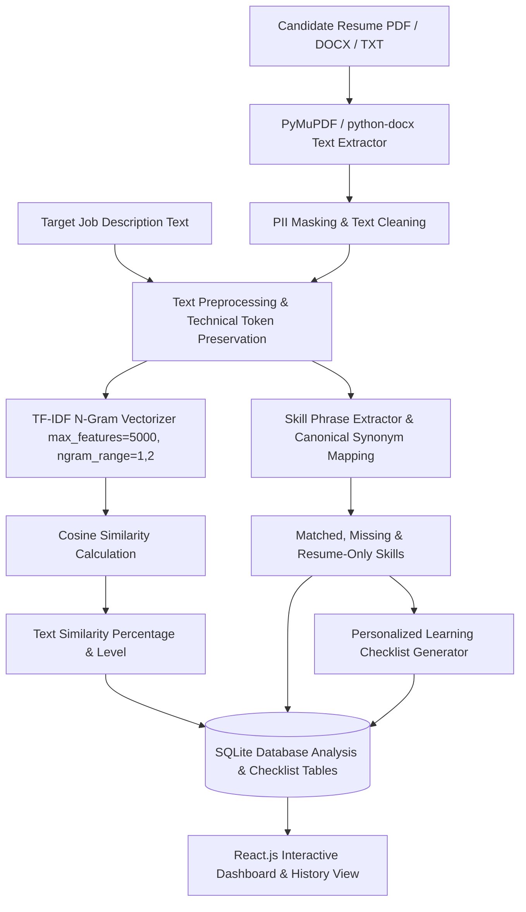

# Short-Term Industry Internship Review Presentation
## Project Title: AI-Based Resume Screening and Job Matching System

**Student Name:** Meda Geethika  
**Register Number:** 239X1A05D6  
**Degree & Branch:** B.Tech – Computer Science and Engineering  
**Institution:** G. Pulla Reddy Engineering College (Autonomous), Kurnool  
**Organization:** InternPe | Domain: Artificial Intelligence / Machine Learning  
**Faculty Guide:** Smt. Y. Supriya Reddy, Department of CSE  

---

## 📋 Table of Contents & Slide Index (20 Slides)

- [Slide 1: Title Slide](#slide-1--title-slide)
- [Slide 2: Student & Internship Details](#slide-2--student--internship-details)
- [Slide 3: About InternPe & Internship Role](#slide-3--about-internpe--internship-role)
- [Slide 4: Internship Objectives](#slide-4--internship-objectives)
- [Slide 5: Problem Statement & Motivation](#slide-5--problem-statement--motivation)
- [Slide 6: Proposed System Overview](#slide-6--proposed-system-overview)
- [Slide 7: End-to-End System Workflow](#slide-7--end-to-end-system-workflow)
- [Slide 8: System Architecture (Layered View)](#slide-8--system-architecture-layered-view)
- [Slide 9: Document Ingestion & PII Privacy Protection](#slide-9--document-ingestion--pii-privacy-protection)
- [Slide 10: NLP Text Preprocessing Pipeline](#slide-10--nlp-text-preprocessing-pipeline)
- [Slide 11: Feature Representation: TF-IDF Vectorization](#slide-11--feature-representation-tf-idf-vectorization)
- [Slide 12: Similarity Measurement: Cosine Similarity](#slide-12--similarity-measurement-cosine-similarity)
- [Slide 13: Skill Extraction & Canonical Synonym Mapping](#slide-13--skill-extraction--canonical-synonym-mapping)
- [Slide 14: Skill Gap Analysis & Personalized Learning Roadmap](#slide-14--skill-gap-analysis--personalized-learning-roadmap)
- [Slide 15: Modular System Implementation](#slide-15--modular-system-implementation)
- [Slide 16: Technology Stack & Tools](#slide-16--technology-stack--tools)
- [Slide 17: Application Dashboards & Interface Layout](#slide-17--application-dashboards--interface-layout)
- [Slide 18: Challenges & Technical Solutions](#slide-18--challenges--technical-solutions)
- [Slide 19: Skills Acquired & Learning Outcomes](#slide-19--skills-acquired--learning-outcomes)
- [Slide 20: Conclusion & Future Scope](#slide-20--conclusion--future-scope)

---

## SLIDE 1 — TITLE SLIDE

### Slide Layout & Visual Elements
- **Background:** Deep Navy Blue (`#0B1120`) with subtle Teal (`#0D9488`) accent lighting.
- **Header:** Institutional Title Banner.
- **Main Heading:** **AI-Based Resume Screening and Job Matching System**
- **Subtitle:** Short-Term Industry Internship Review Presentation
- **Presenter Card:**
  - **Meda Geethika** | Reg. No: `239X1A05D6`
  - B.Tech – Computer Science and Engineering
  - G. Pulla Reddy Engineering College (Autonomous), Kurnool
- **Organization Tag:** InternPe | Domain: Artificial Intelligence & Machine Learning

---

### 🗣️ Speaker Notes (Slide 1)
> *"Respected Faculty Evaluators, my Guide Smt. Y. Supriya Reddy ma'am, and dear classmates, a very good morning to all of you. My name is Meda Geethika, studying B.Tech in Computer Science and Engineering at G. Pulla Reddy Engineering College (Autonomous), Kurnool, bearing Register Number 239X1A05D6. Today, I am presenting my 8-week Short-Term Industry Internship Review presentation on the project titled 'AI-Based Resume Screening and Job Matching System', completed under the mentorship of InternPe in the Artificial Intelligence and Machine Learning domain. Over the next 15 minutes, I will walk you through the problem statement, system architecture, NLP algorithms, implementation details, and learning outcomes."*

---

## SLIDE 2 — STUDENT & INTERNSHIP DETAILS

### Slide Layout & Visual Cards

| Category | Details |
| :--- | :--- |
| **Student Name** | Meda Geethika |
| **Register Number** | `239X1A05D6` |
| **Branch & Department** | B.Tech – Computer Science and Engineering |
| **Institution** | G. Pulla Reddy Engineering College (Autonomous), Kurnool |
| **Internship Organization** | InternPe |
| **Internship Domain** | Artificial Intelligence / Machine Learning |
| **Internship Title** | Real Time Machine Learning Project Using Python |
| **Duration & Dates** | 8 Weeks (04-05-2026 to 28-06-2026) |
| **Mode of Internship** | Virtual / Remote |
| **Faculty Guide** | Smt. Y. Supriya Reddy, Assistant Professor, Dept. of CSE |

---

### 🗣️ Speaker Notes (Slide 2)
> *"This table summarizes my official internship registration details. I completed my 8-week virtual internship from May 4th, 2026 to June 28th, 2026 with InternPe. The domain assigned was Artificial Intelligence and Machine Learning, focusing on building a real-time Python machine learning project. Throughout this period, I worked under the continuous guidance of our faculty guide, Smt. Y. Supriya Reddy ma'am, to align the technical learning with academic computer science principles."*

---

## SLIDE 3 — ABOUT INTERNPE & INTERNSHIP ROLE

### Slide Content & Highlights

#### About InternPe
- **Organization Focus:** Technology education and career-development organization specializing in practical engineering skills.
- **Key Offerings:** Hands-on internship programs across Software Development, Data Science, Artificial Intelligence, and Machine Learning.
- **Learning Methodology:** Task-oriented learning, real-world project activities, and Python framework exposure.

#### My Role & Core Responsibilities
- **Domain:** AI / Machine Learning Project Intern.
- **Primary Deliverable:** End-to-end design, implementation, and evaluation of an NLP-driven resume screening and job-matching system.
- **Key Responsibilities:**
  - Processing unstructured text documents (PDF/DOCX/TXT).
  - Building feature extraction pipelines using Scikit-Learn (TF-IDF vectorization).
  - Designing skill-gap identification logic and personalized learning recommendations.
  - Developing a modular REST API backend (FastAPI) and interactive dashboard (React.js).

---

### 🗣️ Speaker Notes (Slide 3)
> *"InternPe provides project-based learning for computer science engineering students. During my internship, I was tasked with developing a real-time machine learning application in Python. My role involved taking raw, unstructured resume files and job descriptions, applying Natural Language Processing concepts to extract information, and building a working web application. This gave me practical exposure to the complete ML lifecycle, from data preprocessing to web integration."*

---

## SLIDE 4 — INTERNSHIP OBJECTIVES

### Slide Layout — Visual Icon Cards

```
┌───────────────────────────────────────────────────────────┐
│                   INTERNSHIP OBJECTIVES                   │
├─────────────────────────────┬─────────────────────────────┤
│ 1. AI/ML Fundamentals       │ 2. Data & NLP Pipelines     │
│ Understand ML workflows,    │ Implement tokenization,     │
│ feature engineering, and    │ cleaning, and technical     │
│ vector representations.     │ phrase extraction.          │
├─────────────────────────────┼─────────────────────────────┤
│ 3. Mathematical Vectoring   │ 4. Full-Stack System Design │
│ Apply TF-IDF vectorization  │ Connect Python FastAPI      │
│ and Cosine Similarity math. │ backend to React.js UI.     │
├─────────────────────────────┼─────────────────────────────┤
│ 5. Skill Gap Diagnostics    │ 6. Ethical AI Implementation│
│ Automate matched vs missing │ Design a career tool that   │
│ skill identification.       │ avoids bias or hiring claims.│
└─────────────────────────────┴─────────────────────────────┘
```

---

### 🗣️ Speaker Notes (Slide 4)
> *"The primary objectives of this internship were six-fold: First, to gain hands-on experience with the complete ML project lifecycle; second, to learn Python libraries like Pandas, NumPy, Scikit-Learn, and FastAPI; third, to understand how unstructured text is converted into numerical vectors using TF-IDF; fourth, to calculate text similarity using Cosine Similarity; fifth, to automate skill-gap identification and generate learning roadmaps; and sixth, to ensure the tool operates ethically as a career-assistance system rather than making automated hiring decisions."*

---

## SLIDE 5 — PROBLEM STATEMENT & MOTIVATION

### Traditional Manual Resume Screening Process
```
Resume File (PDF/DOCX) ──> Manual Reading ──> Manual Job Comparison ──> Human Skill Extraction
                                                                                 │
                                                                                 ▼
                                                                     Inconsistent & Slow Results
```

### Challenges in Traditional Screening
- **Time-Consuming:** Recruiters spend 30–60 seconds manually scanning each resume.
- **Complex Technical Vocabularies:** Job descriptions contain extensive multi-word frameworks (`React.js`, `FastAPI`, `CI/CD`) that can be overlooked.
- **Lack of Candidate Feedback:** Job seekers rarely receive feedback on *why* their resume missed a match or *which* specific skills they need to learn.
- **Keyword Flaws:** Simple keyword counting fails to capture vocabulary overlap or phrase variations.

---

### Problem Statement Definition
> *"Develop an automated NLP/ML-based web application that parses unstructured candidate resumes, compares them against target job descriptions using TF-IDF and Cosine Similarity, highlights matched and missing skills, and provides personalized skill-gap learning recommendations."*

---

### 🗣️ Speaker Notes (Slide 5)
> *"In the traditional hiring and preparation process, manual resume evaluation is slow, repetitive, and subjective. Recruiters manually read through hundreds of resumes, while candidates applying for technical roles often have no clear idea of why their resume failed to match a job description. Furthermore, simple keyword matching is flawed because candidates write skills in different ways—for example, writing 'React.js' instead of 'React'. Our problem statement addresses this gap by building an intelligent NLP system that measures text similarity, extracts technical skills, and provides actionable feedback to students."*

---

## SLIDE 6 — PROPOSED SYSTEM OVERVIEW

### Proposed Solution Architecture Summary
- **Intelligent Document Ingestion:** Supports PDF, DOCX, and TXT resumes with automatic text extraction and PII privacy masking.
- **Robust Preprocessing Engine:** Cleans noise, normalizes case, removes stop words, and preserves technical programming symbols (`C++`, `C#`, `.NET`, `React.js`).
- **Mathematical Vector Space Matching:** Uses TF-IDF N-gram vectorization and Cosine Similarity to compute text similarity percentages.
- **Transparent Skill Dictionary Engine:** Matches skills using phrase boundary regex and canonical synonym mapping (`React.js` $\rightarrow$ `React`).
- **Personalized Skill Roadmap:** Generates action-oriented practice project recommendations for missing skills with persistent status tracking (`Not Started`, `In Progress`, `Completed`).
- **SQLite Historical Persistence:** Stores analysis runs and checklist items in a relational database.

> **Crucial Disclaimer:** The system acts strictly as an educational career-assistance tool and does NOT predict hiring probability or evaluate personal attributes.

---

### 🗣️ Speaker Notes (Slide 6)
> *"To solve the problem, we proposed a full-stack ML application. The system ingests resumes in PDF, DOCX, or TXT format, cleans the text while protecting technical terms like C++ and React.js, converts the text into numerical vectors using TF-IDF, calculates similarity using Cosine Similarity, categorizes skills into matched and missing, and generates a personalized learning roadmap. Importantly, we clearly state in the application interface that this is a career assistance diagnostic tool, not an automated hiring system."*

---

## SLIDE 7 — END-TO-END SYSTEM WORKFLOW



---

### 🗣️ Speaker Notes (Slide 7)
> *"This flowchart illustrates the complete end-to-end data processing workflow. The user provides a resume and a job description. The document parser extracts text, sanitizes PII, and sends it to the NLP engine. Here, text preprocessing preserves key technical symbols. Then, TF-IDF converts the texts into high-dimensional vectors, and Cosine Similarity computes the similarity score. Simultaneously, the skill extractor matches terms against our skill dictionary, categorizes them into matched and missing skills, generates project exercises for missing skills, and saves the full analysis into SQLite for display on the React dashboard."*

---

## SLIDE 8 — SYSTEM ARCHITECTURE (LAYERED VIEW)

```
┌──────────────────────────────────────────────────────────────────────────┐
│                   PRESENTATION LAYER (React.js + Vite)                   │
│   Dashboard  │  Analyze Engine  │  History Log  │  Skills Dictionary     │
└────────────────────────────────────┬─────────────────────────────────────┘
                                     │ REST API (JSON / HTTP)
┌────────────────────────────────────▼─────────────────────────────────────┐
│                    APPLICATION BACKEND (Python FastAPI)                   │
│   CORS Middleware  │  Route Controllers  │  Pydantic Request Schemas     │
└────────────────────────────────────┬─────────────────────────────────────┘
                                     │
┌────────────────────────────────────▼─────────────────────────────────────┐
│                       DOCUMENT PARSING & PII LAYER                       │
│   PyMuPDF (fitz)  │  python-docx  │  Regex PII Masker (Email / Phone)    │
└────────────────────────────────────┬─────────────────────────────────────┘
                                     │
┌────────────────────────────────────▼─────────────────────────────────────┐
│                    NLP & MACHINE LEARNING PIPELINE                       │
│   Preprocessing  │  TF-IDF Vectorizer  │ Cosine Sim  │ Skill Extractor   │
└────────────────────────────────────┬─────────────────────────────────────┘
                                     │ ORM (SQLAlchemy)
┌────────────────────────────────────▼─────────────────────────────────────┐
│                      PERSISTENCE LAYER (SQLite3)                         │
│   resumes  │  job_descriptions  │  analysis_results  │  checklist_items │
└──────────────────────────────────────────────────────────────────────────┘
```

---

### 🗣️ Speaker Notes (Slide 8)
> *"Slide 8 displays our multi-tier layered system architecture. At the top is the Presentation Layer built with React.js and Tailwind CSS. The frontend communicates with the Application Backend built using Python FastAPI via REST APIs. When a request arrives, the backend passes the document to the Document Processing Layer where PyMuPDF or python-docx extracts raw text and masks PII. The text then flows into the Machine Learning Engine containing Scikit-Learn TF-IDF vectorizers and Cosine Similarity functions. Finally, results are persisted into SQLite tables via SQLAlchemy ORM."*

---

## SLIDE 9 — DOCUMENT INGESTION & PII PRIVACY PROTECTION

### 1. Document Format Handling
- **PDF Documents:** Parsed using PyMuPDF (`fitz`), iterating through text blocks while validating layout structure.
- **DOCX Documents:** Parsed using `python-docx`, reading paragraph vectors and table cells.
- **TXT Documents:** Direct UTF-8 plain text reader.

### 2. Error Handling & Edge Case Safeguards
- **Empty / Scanned PDF Detection:** Catches 0-page or unreadable image-only scanned PDFs and returns clear user diagnostic messages.
- **File Size Validation:** Restricts uploads to a maximum of 5MB.
- **Minimum Text Validation:** Enforces a minimum 30-character text threshold for meaningful analysis.

### 3. PII (Personally Identifiable Information) Privacy Masking
- **Privacy Preservation:** Personal contact attributes are masked automatically prior to vectorization:
  - Emails $\rightarrow$ `[CONFIDENTIAL_EMAIL]`
  - Phone Numbers $\rightarrow$ `[CONFIDENTIAL_PHONE]`
  - Web URLs $\rightarrow$ `[CONFIDENTIAL_URL]`

---

### 🗣️ Speaker Notes (Slide 9)
> *"Slide 9 covers document parsing and privacy protection. Resumes come in various file formats—PDF, DOCX, and TXT. We implemented robust parsers using PyMuPDF and python-docx. If a user uploads an unreadable image-based scanned PDF, the parser catches the error and instructs the user gracefully. Furthermore, to comply with ethical data practices, we built regex-based PII sanitization that automatically replaces emails, phone numbers, and personal website links with confidential placeholders before NLP processing."*

---

## SLIDE 10 — NLP TEXT PREPROCESSING PIPELINE

### Step-by-Step Preprocessing Steps

```
Raw Text ──> Technical Token Protection ──> Lowercasing ──> Noise Removal ──> Whitespace Collapse
```

### Technical Token Preservation Strategy
Standard tokenization strips punctuation, which destroys critical programming terms:
- `C++` $\rightarrow$ converted to `cplusplus`
- `C#` $\rightarrow$ converted to `csharp`
- `.NET` $\rightarrow$ converted to `dotnet`
- `React.js` $\rightarrow$ converted to `reactjs`
- `Node.js` $\rightarrow$ converted to `nodejs`
- `CI/CD` $\rightarrow$ converted to `cicd`

### Detailed Pipeline Actions
1. **Case Normalization:** Converts text to lowercase for consistent vocabulary matching.
2. **Noise Cleanup:** Removes special punctuation while retaining hyphenated/slashed technical tokens.
3. **Stop-Word Removal:** Filters out high-frequency generic English words (`the`, `and`, `with`, `is`) using Scikit-Learn's English stop-word dictionary.

---

### 🗣️ Speaker Notes (Slide 10)
> *"Text preprocessing is one of the most critical steps in any NLP pipeline. If you use standard regex cleaning on programming terms, 'C++' becomes just 'C', and 'React.js' becomes 'React' and 'js'. To solve this, we built a custom technical token preservation engine. Before tokenization, terms like C++ are mapped to 'cplusplus', C# to 'csharp', and React.js to 'reactjs'. After protecting these terms, the text is lowercased, punctuation is cleaned, generic English stop-words are removed, and multi-space gaps are collapsed."*

---

## SLIDE 11 — FEATURE REPRESENTATION: TF-IDF VECTORIZATION

### What is TF-IDF?
**Term Frequency-Inverse Document Frequency (TF-IDF)** converts text strings into numerical sparse vector space models by assessing the relative importance of terms across documents.

$$\text{TF}(t, d) = \frac{\text{Count of term } t \text{ in document } d}{\text{Total terms in document } d}$$

$$\text{IDF}(t, D) = \log\left(\frac{1 + |D|}{1 + |\{d \in D : t \in d\}|}\right) + 1$$

$$\text{TF-IDF}(t, d, D) = \text{TF}(t, d) \times \text{IDF}(t, D)$$

### Vectorizer Configuration Parameters
- **`max_features=5000`:** Restricts vocabulary to top 5,000 informative terms, reducing memory footprint.
- **`ngram_range=(1, 2)`:** Extracts single words (*unigrams*, e.g., `Python`) and two-word phrases (*bigrams*, e.g., `Machine Learning`, `REST API`).
- **`sublinear_tf=True`:** Applies $1 + \log(\text{TF})$ dampening to prevent excessively repeated keywords from distorting scores.

---

### 🗣️ Speaker Notes (Slide 11)
> *"To allow mathematical algorithms to compare resumes with job descriptions, we must convert text into numbers. We use TF-IDF vectorization. Term Frequency measures how often a word appears in a document, while Inverse Document Frequency dampens common words and gives higher weight to rare, informative technical terms like 'FastAPI' or 'Kubernetes'. We configured Scikit-Learn's TfidfVectorizer with an N-gram range of (1, 2). This allows our model to capture both single-word skills like 'Python' and two-word phrases like 'Machine Learning' or 'REST API'."*

---

## SLIDE 12 — SIMILARITY MEASUREMENT: COSINE SIMILARITY

### Mathematical Concept
Cosine Similarity calculates the cosine of the angle between two non-zero vectors ($\vec{A}$ representing the resume and $\vec{B}$ representing the job description) in multi-dimensional space.

$$\text{Cosine Similarity}(\vec{A}, \vec{B}) = \frac{\vec{A} \cdot \vec{B}}{\|\vec{A}\| \|\vec{B}\|} = \frac{\sum_{i=1}^{n} A_i B_i}{\sqrt{\sum_{i=1}^{n} A_i^2} \sqrt{\sum_{i=1}^{n} B_i^2}}$$

```
       Vector B (Job Description)
             ^
             │   θ (Angle between vectors)
             │  /
             │ /  Vector A (Resume)
             │/
             └──────────────────────>
      cos(θ) = 1.0  ──> Perfect Vocabulary Match (0° angle)
      cos(θ) = 0.0  ──> Orthogonal / No Overlap (90° angle)
```

### Score Interpretation & Boundaries
- **80% – 100%:** High Text Similarity
- **55% – 79%:** Moderate Text Similarity
- **30% – 54%:** Fair Text Similarity
- **0% – 29%:** Low Text Similarity

---

### 🗣️ Speaker Notes (Slide 12)
> *"Once the resume and job description are converted into TF-IDF vectors, we measure their alignment using Cosine Similarity. Mathematically, Cosine Similarity calculates the dot product of the two vectors divided by the product of their magnitudes. If two documents use identical technical terms in similar proportions, the angle between their vectors approaches 0 degrees, giving a Cosine Similarity score near 1.0 or 100%. If they share no vocabulary, the vectors are orthogonal, yielding 0%. This percentage is presented on our dashboard clearly as a Text Similarity Score."*

---

## SLIDE 13 — SKILL EXTRACTION & CANONICAL SYNONYM MAPPING

### Transparent Skill Catalog Dictionary (`data/skills.json`)
Contains 150+ categorized IT and engineering skills mapped to canonical standard names:

```json
{
  "Programming Languages": [
    { "name": "Python", "synonyms": ["py", "python3", "python 3"] },
    { "name": "JavaScript", "synonyms": ["js", "es6", "javascript"] },
    { "name": "React", "synonyms": ["react.js", "reactjs", "react js"] }
  ]
}
```

### Extraction & Normalization Mechanism
1. **Phrase Boundary Matching:** Employs boundary regex `(?:\b|_)<term>(?:\b|_)` to prevent substring false positives (e.g., matching `Java` inside `JavaScript`).
2. **Canonical Mapping:** Maps aliases to standard skill names (`React.js` $\rightarrow$ `React`).
3. **Category Breakdown:**
   - **Matched Skills:** Skills present in both resume and job description.
   - **Missing Skills:** Skills requested in job description but missing from resume.
   - **Resume-Only Skills:** Additional skills present in resume beyond job specs.

---

### 🗣️ Speaker Notes (Slide 13)
> *"In addition to statistical vector similarity, our system performs transparent phrase-based skill extraction. We created an extensible JSON skill dictionary containing over 150 categorized technical skills with synonym mappings. For example, if a resume contains 'React.js' and the job post asks for 'ReactJS', our canonical lookup table maps both to the standard name 'React'. Using boundary regular expressions, we prevent false sub-string matches—such as accidentally matching 'Java' inside 'JavaScript'. This categorizes skills into Matched, Missing, and Resume-Only skills."*

---

## SLIDE 14 — SKILL GAP ANALYSIS & PERSONALIZED LEARNING ROADMAP

### Conceptual Example

```
Target Job Specs:  Java, Python, SQL, React, Docker, Kubernetes, CI/CD
Candidate Resume:  Java, Python, SQL, React, Git

                  │
                  ▼
┌──────────────────────────────────────────────────────────────────────────┐
│                             ANALYSIS OUTPUT                              │
├──────────────────────────────────────────────────────────────────────────┤
│ Matched Skills (4):  Java, Python, SQL, React                            │
│ Missing Skills (3):  Docker, Kubernetes, CI/CD                           │
└──────────────────────────────────────────────────────────────────────────┘
```

### Automated Learning Recommendation Generation
For every missing skill, the system automatically generates a learning record:

| Missing Skill | Relevance Context | Suggested Practice Project | Level | Status |
| :--- | :--- | :--- | :--- | :--- |
| **Docker** | Containerization tool requested for reproducible microservice execution. | Create multi-stage Dockerfiles for backend and frontend with Docker Compose. | Intermediate | `[Not Started]` |
| **CI/CD** | Automation framework for continuous testing and deployment. | Set up GitHub Actions workflows for automated pytest execution. | Intermediate | `[Not Started]` |

---

### 🗣️ Speaker Notes (Slide 14)
> *"Slide 14 demonstrates the core student-assistance feature: Skill Gap Analysis and Personalized Roadmaps. In this example, the candidate possesses Java, Python, SQL, and React, but lacks Docker, Kubernetes, and CI/CD requested by the job description. For each missing skill, the system queries our recommendation engine and automatically generates a practical project exercise, assigns a proficiency level based on job context, and tracks progress via interactive status buttons—Not Started, In Progress, or Completed."*

---

## SLIDE 15 — MODULAR SYSTEM IMPLEMENTATION

```
┌──────────────────────────────────────────────────────────────────────────┐
│                   FASTAPI BACKEND MODULE ARCHITECTURE                    │
├──────────────────┬───────────────────────────────────────────────────────┤
│ Module           │ Responsibility                                        │
├──────────────────┼───────────────────────────────────────────────────────┤
│ parser.py        │ PDF/DOCX/TXT text extraction and PII masking          │
│ preprocessing.py │ C++, C#, .NET token protection & text cleaning        │
│ vectorizer.py    │ TF-IDF vectorizer configuration & joblib persistence  │
│ similarity.py    │ Cosine similarity & Jaccard keyword baseline math     │
│ skill_extractor.py│ Phrase boundary regex matching & canonical dictionary│
│ pipeline.py      │ Master orchestrator unifying ML steps and roadmaps    │
│ semantic_matcher.py│ Optional sentence-transformer embedding comparator   │
│ models.py        │ SQLAlchemy ORM database schemas                      │
│ router endpoints │ REST API route handlers (/upload, /analyze, /skills) │
└──────────────────┴───────────────────────────────────────────────────────┘
```

---

### 🗣️ Speaker Notes (Slide 15)
> *"The backend is architected in a modular structure inside FastAPI. Each component has a distinct single responsibility: `parser.py` handles multi-format file reading and PII masking; `preprocessing.py` handles technical token protection; `vectorizer.py` wraps Scikit-Learn's TF-IDF vectorizer; `similarity.py` calculates Cosine and Jaccard metrics; `skill_extractor.py` handles phrase matching; `pipeline.py` orchestrates the entire workflow; and `models.py` manages SQLAlchemy database models. This modular architecture makes the project easy to debug, test, and expand."*

---

## SLIDE 16 — TECHNOLOGY STACK & TOOLS

### Comprehensive Stack Summary Table

| Layer / Domain | Technology / Tool | Purpose in Project |
| :--- | :--- | :--- |
| **Programming Language** | Python 3.14 | Core backend logic, ML modeling, and text processing |
| **Machine Learning / NLP** | Scikit-Learn | `TfidfVectorizer` and `cosine_similarity` computations |
| **Data Manipulation** | Pandas & NumPy | Array operations, matrix manipulation, and evaluation |
| **Document Parsing** | PyMuPDF (`fitz`) & `python-docx` | Text extraction from PDF and DOCX resume files |
| **Model Persistence** | Joblib | Serialization and reloading of vectorizer models |
| **Backend Framework** | FastAPI & Uvicorn | High-performance asynchronous REST API server |
| **Database & ORM** | SQLite3 & SQLAlchemy 2.0 | Persistent relational storage for history and checklists |
| **Frontend Framework** | React.js 18 & Vite | Interactive single-page web dashboard user interface |
| **Styling & UI Components**| Tailwind CSS & Lucide Icons | Responsive glassmorphic UI layout and styling |
| **Testing Suite** | Pytest & HTTPX | Automated unit testing for parsers, ML pipeline, and APIs |

---

### 🗣️ Speaker Notes (Slide 16)
> *"Slide 16 summarizes the full technology stack. On the backend, we use Python 3.14, Scikit-Learn for TF-IDF and Cosine Similarity, Pandas and NumPy for data manipulation, PyMuPDF and python-docx for document parsing, and FastAPI with Uvicorn for serving REST APIs. On the database side, we use SQLite3 with SQLAlchemy ORM. On the frontend, we use React.js with Vite, Tailwind CSS for glassmorphic styling, and Lucide React for UI icons. Automated testing is handled using Pytest."*

---

## SLIDE 17 — APPLICATION DASHBOARDS & INTERFACE LAYOUT

```
┌──────────────────────────────────────────────────────────────────────────┐
│                          REACT.JS DASHBOARD UI                           │
├─────────────────────────────────────┬────────────────────────────────────┤
│ 1. Dual-Pane Analysis Engine        │ 2. Circular Similarity Gauge       │
│    - File Dropzone (PDF/DOCX/TXT)   │    - Radial SVG match score %      │
│    - Job Spec Text Editor           │    - Qualitative similarity level  │
│    - Instant Sample Data Loader     │    - Jaccard baseline readout     │
├─────────────────────────────────────┼────────────────────────────────────┤
│ 3. Categorized Skill Badges         │ 4. Interactive Learning Roadmap    │
│    - Green: Matched Skills          │    - Missing skill practice task   │
│    - Amber: Missing Skill Gaps      │    - Proficiency level tag         │
│    - Blue: Extra Resume Skills      │    - Status toggle buttons         │
├─────────────────────────────────────┴────────────────────────────────────┤
│ 5. History Log & Model Evaluation Page                                   │
│    - Searchable SQLite history table, detail view modal, delete record    │
│    - Hyperparameter documentation & precision/recall evaluation metrics  │
└──────────────────────────────────────────────────────────────────────────┘
```

---

### 🗣️ Speaker Notes (Slide 17)
> *"Slide 17 illustrates the user interface layout of our React application. The interface contains five main panels: First, an Interactive Dual-Pane Editor for uploading resumes and entering job descriptions; Second, a Radial SVG Similarity Gauge displaying the Cosine match percentage and qualitative level; Third, Categorized Skill Badges using green for matched, amber for missing, and blue for extra skills; Fourth, an Interactive Learning Roadmap table where users toggle skill progress; and Fifth, an Analysis History Log and Model Evaluation Page."*

---

## SLIDE 18 — CHALLENGES & TECHNICAL SOLUTIONS

### Challenge vs Solution Matrix

| # | Challenge Encountered | Technical Approach | Implemented Solution |
| :---: | :--- | :--- | :--- |
| **1** | **Special Symbol Destruction**<br>Standard regex strips `+`, `#`, and `.` from terms like `C++`, `C#`, `React.js`. | Technical Token Protection | Built pre-tokenization regex mapper converting `C++` $\rightarrow$ `cplusplus`, `C#` $\rightarrow$ `csharp`, `.NET` $\rightarrow$ `dotnet`. |
| **2** | **Synonym Phrasing Variance**<br>Candidates write `React.js` or `ReactJS`, while jobs ask for `React`. | Canonical Dictionary Lookup | Developed `data/skills.json` catalog mapping variations to standardized canonical skill names. |
| **3** | **Unreadable / Scanned PDFs**<br>Image-only PDFs produce 0 extracted text characters. | Exception Safeguards & Validation | Implemented 0-character page detection returning clear diagnostic error guidance. |
| **4** | **Candidate PII Exposure**<br>Storing emails/phones exposes personal data unnecessarily. | Automated Privacy Masking | Built regex sanitization replacing emails, phone numbers, and URLs with confidential placeholders. |
| **5** | **Over-fitting Keyword Counts**<br>Repeated keywords distort similarity scores. | Sublinear TF Dampening | Configured Scikit-Learn `sublinear_tf=True` ($1 + \log(\text{TF})$) to dampen term frequencies. |

---

### 🗣️ Speaker Notes (Slide 18)
> *"During implementation, we encountered five key technical challenges: First, standard tokenization destroyed special programming symbols like C++ and C#. We solved this using pre-tokenization regex preservation. Second, synonym variance caused identical skills to be missed. We solved this with a canonical dictionary lookup. Third, scanned image PDFs produced zero text. We implemented page content validation safeguards. Fourth, storing contact details posed privacy concerns. We built automated PII regex masking. Fifth, keyword repetition distorted scores. We applied sublinear term frequency dampening."*

---

## SLIDE 19 — SKILLS ACQUIRED & LEARNING OUTCOMES

```
┌──────────────────────────────────────────────────────────────────────────┐
│                       INTERNSHIP LEARNING OUTCOMES                       │
├──────────────────────────┬──────────────────────┬────────────────────────┤
│ 1. Technical Mastery     │ 2. Practical Engineering │ 3. Professional Skills │
│ - Python 3.14            │ - End-to-end ML lifecycle│ - Problem Solving      │
│ - Scikit-Learn & NLP     │ - Document parsing   │ - Analytical Thinking  │
│ - TF-IDF & Cosine Math   │ - REST API design    │ - Technical Writing    │
│ - Pandas & NumPy         │ - Database ORM       │ - Code Documentation   │
│ - FastAPI & React.js     │ - Automated Pytest   │ - Academic Presentation│
└──────────────────────────┴──────────────────────┴────────────────────────┘
```

### Key Internship Learning Highlights
- **ML Lifecycle Understanding:** Gained practical experience in dataset handling, data cleaning, feature vectorization, similarity metrics, and web deployment.
- **Full-Stack ML Integration:** Learned how to expose Python machine learning models through FastAPI REST APIs and consume them in a modern React frontend.
- **Software Quality Assurance:** Wrote 12 unit and integration tests using Pytest to ensure parser reliability, token preservation, and endpoint correctness.

---

### 🗣️ Speaker Notes (Slide 19)
> *"This internship provided immense learning outcomes across three dimensions: Technical Mastery, Practical Engineering, and Professional Skills. Technically, I mastered Python-based NLP, Scikit-Learn TF-IDF vectorization, Cosine Similarity math, FastAPI, and React.js. Practically, I learned how to handle unstructured real-world document parsing, build REST APIs, integrate databases using SQLAlchemy, and write unit tests with Pytest. Professionally, I strengthened my problem-solving ability, technical documentation, and academic presentation skills."*

---

## SLIDE 20 — CONCLUSION & FUTURE SCOPE

### Key Project Conclusions
- Successfully developed and deployed a working **AI-Based Resume Screening and Job Matching System**.
- Applied **TF-IDF vectorization** and **Cosine Similarity** to compute accurate text similarity metrics.
- Built a **transparent skill dictionary** supporting phrase boundary regex and canonical synonym mapping.
- Implemented an **interactive learning roadmap** with persistent SQLite progress tracking.
- Achieved **100% test pass rate** across 12 automated Pytest unit and integration tests.

### Future Enhancements & Scope
- **Advanced Semantic Transformers:** Integrate Sentence-BERT (`all-MiniLM-L6-v2`) embeddings for contextual semantic matching beyond TF-IDF vocabulary overlap.
- **Negation Detection:** Add dependency parsing to recognize phrases like *"not familiar with Docker"*.
- **Expanded Skill Catalog:** Broaden skill dictionary to cover domain-specific engineering fields.
- **Cloud Deployment:** Deploy backend to Render/Koyeb and frontend to Vercel/Netlify for permanent multi-device public hosting.

---

```
────────────────────────────────────────────────────────────────────────────
                           THANK YOU!
               Questions & Discussion Welcome
────────────────────────────────────────────────────────────────────────────
```

---

### 🗣️ Speaker Notes (Slide 20)
> *"In conclusion, this internship project successfully bridges the gap between candidate resumes and job descriptions using Natural Language Processing and Machine Learning. We developed a working system that extracts skills, measures TF-IDF vector similarity, identifies skill gaps, and guides student preparation—all while maintaining data privacy and ethical disclaimers. In the future, we plan to incorporate advanced transformer models like Sentence-BERT for deeper contextual understanding and expand our skill dictionary. I extend my sincere gratitude to InternPe, our department, and my faculty guide Smt. Y. Supriya Reddy ma'am for their constant support. Thank you, and I am now open to any questions."*

---

## 🎓 Master Viva-Voce Questions & Answers Guide for Presentation

Below are key viva questions evaluators may ask during your presentation, along with concise answers:

### Q1: Why did you choose TF-IDF over simple keyword counting or Word2Vec?
> **Answer:** Simple keyword counting treats all words equally, giving high weight to frequent generic words. TF-IDF downweights common words using Inverse Document Frequency while emphasizing rare technical terms. While Word2Vec or Transformer embeddings capture semantic context, TF-IDF is deterministic, fast, lightweight, reproducible, and easily explainable for term overlap analysis without requiring heavy GPU infrastructure.

### Q2: How do you calculate Cosine Similarity between a resume and job description?
> **Answer:** Both documents are converted into TF-IDF sparse feature vectors $\vec{A}$ and $\vec{B}$. Cosine similarity calculates the dot product of $\vec{A}$ and $\vec{B}$ divided by the product of their Euclidean lengths ($\|\vec{A}\| \|\vec{B}\|$). This measures the cosine of the angle between the two vectors in 5,000-dimensional space, returning a score between 0.0 (orthogonal/no match) and 1.0 (identical vector direction).

### Q3: How does your system handle symbols in programming terms like C++ or React.js?
> **Answer:** Standard tokenizers strip punctuation, turning `C++` into `C` and `React.js` into `React` and `js`. In `app/ml/preprocessing.py`, we implemented a pre-tokenization regex mapper that converts `C++` to `cplusplus`, `C#` to `csharp`, `.NET` to `dotnet`, and `React.js` to `reactjs` before tokenization occurs.

### Q4: Does your system make hiring decisions or predict candidate selection?
> **Answer:** No. We explicitly state in the application and documentation that this system is a career-assistance and educational diagnostic tool. It evaluates textual vocabulary similarity and skill gaps to help students prepare for job roles. It does not evaluate hiring probability or personal attributes.

### Q5: What database structure is used to store analysis history and learning roadmaps?
> **Answer:** We use SQLite3 with SQLAlchemy 2.0 ORM containing 4 relational tables: `resumes`, `job_descriptions`, `analysis_results`, and `learning_checklist_items`. When an analysis runs, the results and generated missing skill checklist items are saved with foreign key constraints, allowing users to track skill completion over time.
